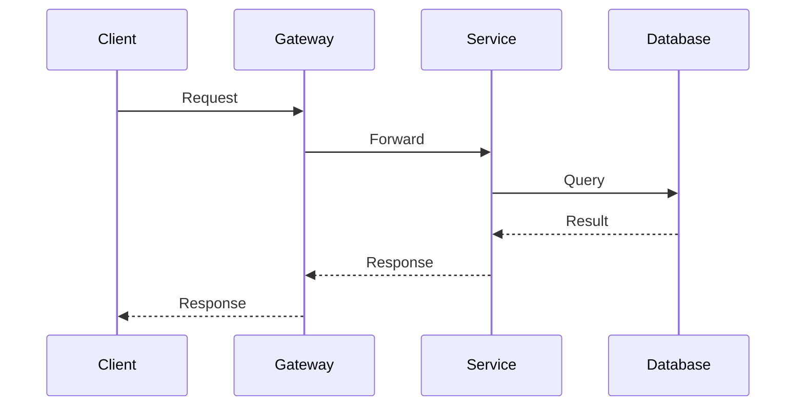

# Mermaid Diagram Guidelines for PDF/Print

Diagrams must be readable when rendered to PDF and printed on A4/Letter paper.

## Diagram Type Selection

| Use Case | Diagram Type | Syntax |
|----------|-------------|--------|
| Component relationships | Flowchart | `graph TD` or `graph LR` |
| Data/request flow | Sequence | `sequenceDiagram` |
| Entity relationships | ER | `erDiagram` |
| State machines | State | `stateDiagram-v2` |
| Deployment topology | Flowchart with subgraph | `graph TD` |

AVOID (poor PDF rendering):
- `gantt` — timeline charts
- `pie` — use tables instead
- `journey` — renders inconsistently
- `mindmap` — too wide for print
- `gitgraph` — too specialized

## Node and Label Rules

- **Max 7-10 nodes** per diagram — split into multiple diagrams if more
- **Node labels**: max 3 words (abbreviate if needed)
- **Edge labels**: max 4 words
- Title each diagram with a Markdown heading explaining what it shows

## Layout Rules

- `graph TD` (top-down) for hierarchies and component diagrams
- `graph LR` (left-right) for flow/pipeline diagrams
- `sequenceDiagram` for request/response flows
- NEVER use `graph RL` or `graph BT`

## Subgraph Rules

- Max **1 level** of nesting (subgraph inside graph, never deeper)
- Max **3-4 subgraphs** per diagram
- Each subgraph: **2-5 nodes**
- Short subgraph labels

## PDF-Safe Styling

Use these colors only:

| Purpose | Color | Hex |
|---------|-------|-----|
| Default fill | Light gray | `#e8e6dc` |
| Success/green | Light green | `#d4edda` |
| Info/blue | Light blue | `#cce5ff` |
| Warning/yellow | Light yellow | `#fff3cd` |
| Error/red | Light red | `#f8d7da` |
| Border | Dark | `#141413` |
| Alt border | Gray | `#495057` |
| Text | Dark | `#141413` |

Style syntax:
```
style NodeA fill:#e8e6dc,stroke:#141413,stroke-width:2px
```

DO NOT use:
- External CSS classes with complex styles
- Transparency/opacity
- Custom fonts
- Gradient fills
- Very light colors (disappear in print)

## Sequence Diagram Rules

- Max **5 participants**
- Max **10-12 messages** per diagram
- Use short participant aliases
- Group related messages with `rect` blocks (max 2 nesting levels)
- Use `Note over` sparingly (1-2 per diagram)

Example:


## ER Diagram Rules

- Max **8-12 entities**
- Show only primary relationships (not every FK)
- Use short attribute names

## Page Break Strategy

- Place each diagram under its own `##` or `###` heading
- Blank line before and after every Mermaid code fence
- Keep diagram + description together (diagram + 2-3 lines of explanation)
- NEVER stack diagrams back-to-back — always separate with explanatory text
- If a section has 2+ diagrams, put each in a subsection

## Anti-Patterns (NEVER do)

- Diagram with 15+ nodes
- Labels longer than 4 words
- More than 1 subgraph nesting level
- HTML in node labels (breaks PDF)
- Special characters in labels without quotes
- "Spider web" diagrams (every node connects to every other)
- Mixing diagram types in one code block
