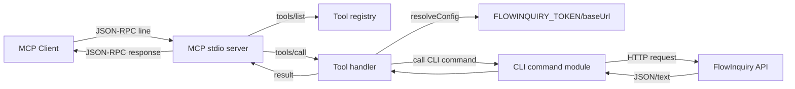

# MCP v2 (CLI Parity) — Change Summary

This document summarizes the changes made to bring the MCP server to full CLI parity (stdio).

## What changed

- Added a per-group MCP tool registry under `apps/mcp/src/tools/` with handlers for all CLI commands.
- Refactored the MCP stdio server to dispatch via the registry and normalize outputs/errors.
- Added shared validation/config helpers and bounded SSE tool support.
- Updated MCP README to document stdio usage and tool examples.

## Session Flow (stdio)

