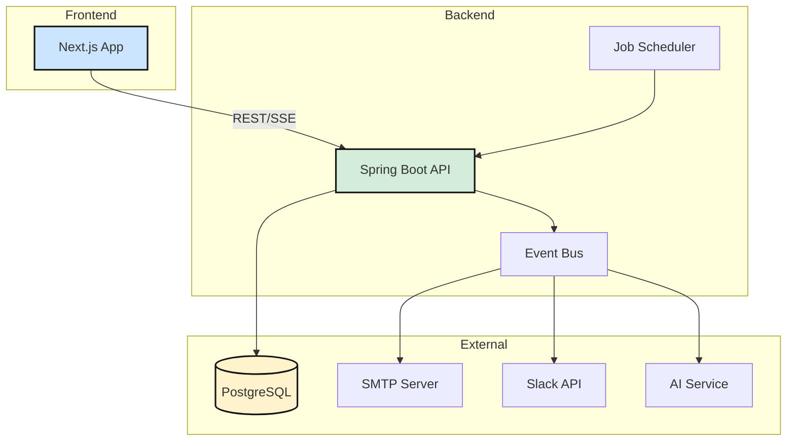
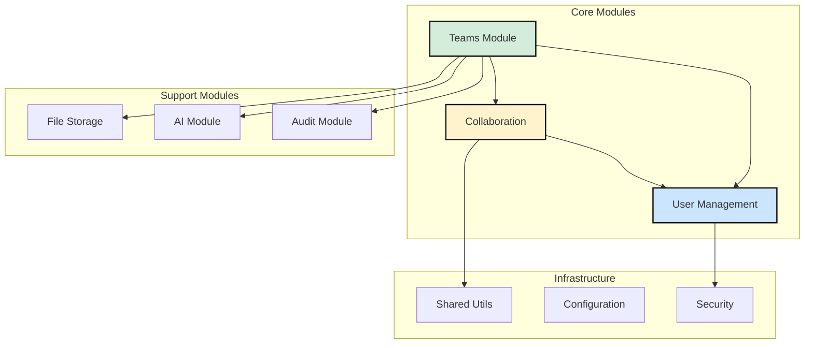
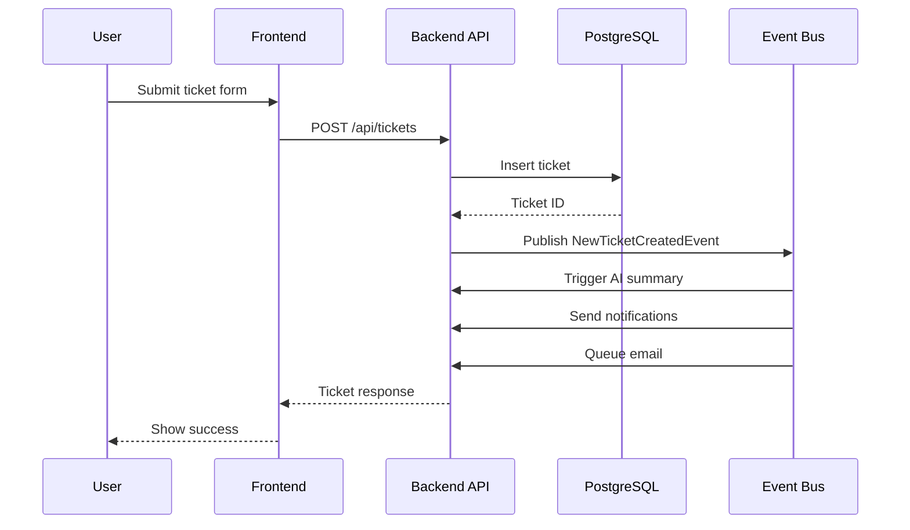
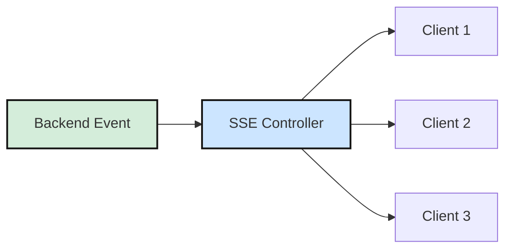
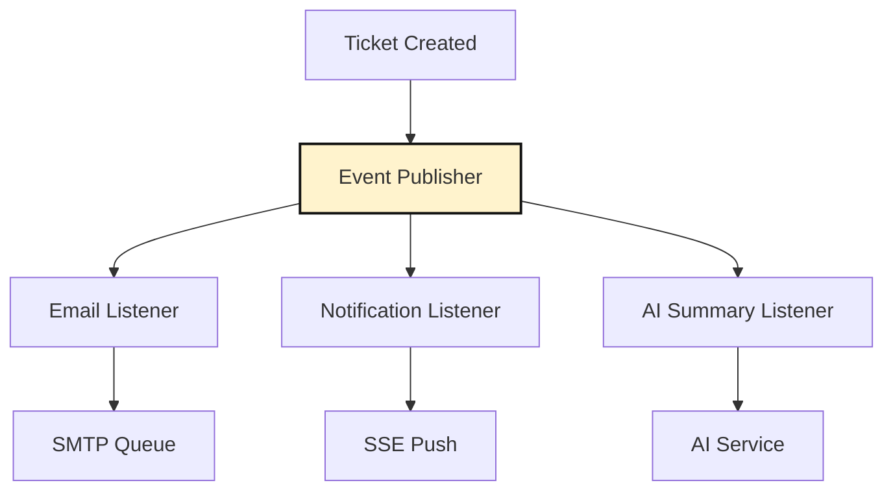
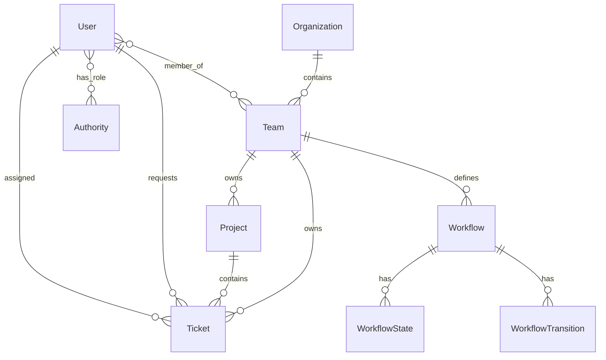
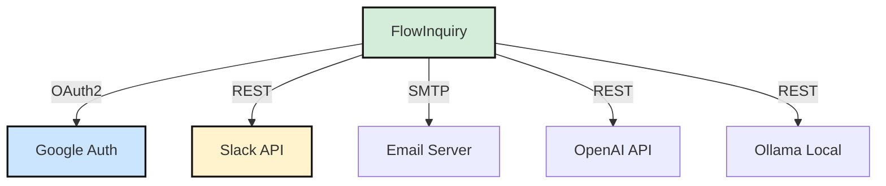
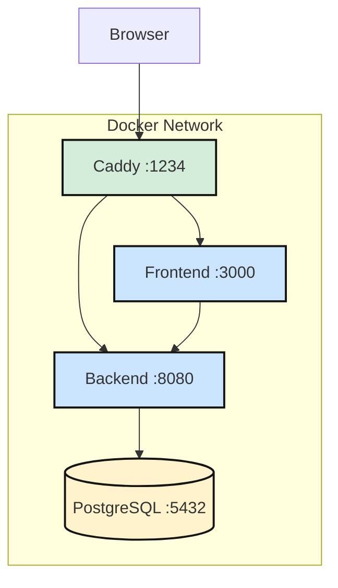
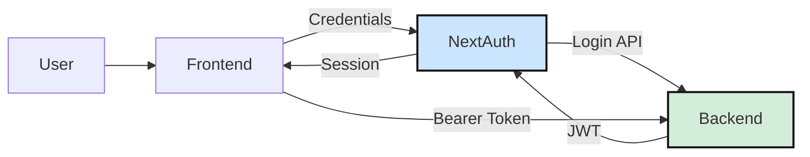

# FlowInquiry - Architecture Documentation

> Open-source project, ticket, and request management platform with workflows, SLA tracking, and team collaboration.
>
> Repository: https://github.com/flowinquiry/flowinquiry
> Generated: March 2026

## Executive Summary

FlowInquiry is a full-stack project and ticket management system designed for teams needing customizable workflows, SLA tracking, and real-time collaboration. The platform follows a modern monorepo architecture with a Spring Boot backend (Java 21) and Next.js frontend (React 19). It supports multi-tenancy, role-based access control (RBAC), and integrates with external services like Slack, email, and AI models. Deployment options include Docker Compose and Kubernetes, with PostgreSQL as the primary datastore.

## System Overview

The system follows a three-tier architecture with a clear separation between presentation, business logic, and data layers. The frontend communicates with the backend exclusively through REST APIs, with real-time updates delivered via Server-Sent Events (SSE).



## Technology Stack

| Category               | Technology                 | Purpose                       |
| ---------------------- | -------------------------- | ----------------------------- |
| **Backend Language**   | Java 21                    | Core business logic           |
| **Backend Framework**  | Spring Boot 3.x            | REST APIs, DI, Security       |
| **Frontend Framework** | Next.js 16 + React 19      | Server/client rendering       |
| **Database**           | PostgreSQL 16              | Primary data store            |
| **ORM**                | Hibernate 6 + JPA          | Object-relational mapping     |
| **Migration**          | Liquibase                  | Schema versioning             |
| **Caching**            | Caffeine + Hibernate L2    | Query and entity caching      |
| **Build (Backend)**    | Gradle                     | Java build automation         |
| **Build (Frontend)**   | pnpm + Turbo               | Node.js monorepo tooling      |
| **Containerization**   | Docker + Jib               | Image building and deployment |
| **Reverse Proxy**      | Caddy                      | HTTP/HTTPS termination        |
| **Auth**               | Spring Security + NextAuth | JWT-based authentication      |
| **AI Integration**     | Spring AI (OpenAI/Ollama)  | Ticket summarization          |

## Repository Structure

```
flowinquiry/
├── apps/
│   ├── backend/           # Spring Boot services
│   │   ├── commons/       # Shared modules, domain entities
│   │   ├── server/        # Main application entry point
│   │   └── tools/         # Liquibase migrations
│   ├── frontend/          # Next.js web application
│   ├── docs/              # Nextra documentation site
│   └── ops/               # Docker/K8s deployment configs
├── docker/                # Local dev Docker Compose
├── gradle/                # Gradle wrapper and profiles
├── tools/                 # Git hooks, setup scripts
├── build.gradle           # Root Gradle config
├── package.json           # Root pnpm workspace config
└── turbo.json             # Turborepo task config
```

## Architecture Patterns

FlowInquiry implements a **Modular Monolith** architecture on the backend with an **Event-Driven** communication pattern between modules. The frontend follows the **App Router** pattern with server components.

### Backend Module Architecture

The backend is organized into cohesive modules under `commons/`, each with its own domain, service, repository, and controller layers.



## Component Breakdown

### Teams Module

**Purpose**: Core business logic for organizations, teams, projects, tickets, and workflows.

**Key paths**: `apps/backend/commons/src/main/java/io/flowinquiry/modules/teams/`

**Responsibilities**:

- Organization and team hierarchy management
- Ticket lifecycle (creation, state transitions, SLA tracking)
- Workflow state machine definition and execution
- Project management with Kanban boards, epics, and iterations
- Statistics and distribution reporting

**Key entities**: `Organization`, `Team`, `Project`, `Ticket`, `Workflow`, `WorkflowState`, `WorkflowTransition`

### User Management Module

**Purpose**: Authentication, authorization, user accounts, and RBAC.

**Key paths**: `apps/backend/commons/src/main/java/io/flowinquiry/modules/usermanagement/`

**Responsibilities**:

- User registration, activation, password management
- OAuth2 social login (Google)
- Authority (role) management
- Resource-based permission system
- Team membership and role assignment

**Key entities**: `User`, `UserAuth`, `Authority`, `AuthorityResourcePermission`, `Resource`

### Collaboration Module

**Purpose**: Cross-cutting collaboration features.

**Key paths**: `apps/backend/commons/src/main/java/io/flowinquiry/modules/collab/`

**Responsibilities**:

- Entity comments (polymorphic across Ticket, Project, etc.)
- In-app notifications via SSE
- Activity logging and audit trails
- Entity watching (subscribe to updates)
- Email sending with template rendering
- Slack integration

**Key entities**: `Comment`, `Notification`, `ActivityLog`, `EntityWatcher`, `EmailJob`

### File Storage Service (FSS)

**Purpose**: File upload, download, and attachment management.

**Key paths**: `apps/backend/commons/src/main/java/io/flowinquiry/modules/fss/`

**Responsibilities**:

- File upload to local storage
- Entity attachment linking
- Avatar image handling

### AI Module

**Purpose**: AI-powered features using Spring AI.

**Key paths**: `apps/backend/commons/src/main/java/io/flowinquiry/modules/ai/`

**Responsibilities**:

- Automatic ticket summarization on creation
- Conversation health evaluation for ticket comments
- Support for OpenAI and Ollama backends

### Frontend Application

**Purpose**: User interface built with Next.js App Router.

**Key paths**: `apps/frontend/src/`

**Responsibilities**:

- Server-rendered pages with client-side interactivity
- NextAuth-based authentication flow
- Permission-guarded routes and components
- Real-time updates via SSE
- Drag-and-drop Kanban boards (dnd-kit)

## Data Flow

### Ticket Creation Flow

This sequence shows the primary flow when a user creates a new ticket.



### Real-Time Notification Flow

The system uses Server-Sent Events for real-time updates to connected clients.



### Event-Driven Processing

Internal events decouple modules and enable async processing.



## Data Model

The core data model centers around the Team-Ticket-Workflow relationship with User management as a cross-cutting concern.

### Core Entities



### Key Entity Attributes

| Entity                 | Key Fields                                             | Purpose                  |
| ---------------------- | ------------------------------------------------------ | ------------------------ |
| **Ticket**             | title, priority, currentState, dueDate, estimatedHours | Main work item           |
| **Workflow**           | name, states[], transitions[], isDefault               | State machine definition |
| **WorkflowTransition** | fromState, toState, slaDuration, escalateTo            | State change rules       |
| **Team**               | name, organization, logoUrl, users[]                   | User grouping            |
| **Project**            | name, shortName, visibility, iterations[], epics[]     | Work container           |

## External Integrations



| Integration       | Purpose            | Configuration                              |
| ----------------- | ------------------ | ------------------------------------------ |
| **Google OAuth**  | Social login       | `GOOGLE_CLIENT_ID`, `GOOGLE_CLIENT_SECRET` |
| **Slack**         | Team notifications | `SLACK_TOKEN_ID`                           |
| **SMTP**          | Email delivery     | App settings in database                   |
| **OpenAI/Ollama** | AI features        | Spring AI configuration                    |

## Configuration and Environment

### Key Environment Variables

| Variable                     | Purpose                      | Required |
| ---------------------------- | ---------------------------- | -------- |
| `SPRING_DATASOURCE_URL`      | PostgreSQL connection string | Yes      |
| `SPRING_DATASOURCE_USERNAME` | Database user                | Yes      |
| `SPRING_DATASOURCE_PASSWORD` | Database password            | Yes      |
| `GOOGLE_CLIENT_ID`           | OAuth client ID              | No       |
| `GOOGLE_CLIENT_SECRET`       | OAuth client secret          | No       |
| `SLACK_TOKEN_ID`             | Slack bot token              | No       |
| `NEXTAUTH_SECRET`            | JWT signing secret           | Yes      |
| `NEXT_PUBLIC_BASE_URL`       | Public frontend URL          | Yes      |
| `BACK_END_URL`               | Backend API URL              | Yes      |

### Spring Profiles

| Profile | Purpose                           |
| ------- | --------------------------------- |
| `dev`   | Local development with hot reload |
| `prod`  | Production optimizations          |
| `test`  | Test environment settings         |

## Deployment Architecture

### Docker Compose Deployment

The standard deployment uses Docker Compose with Caddy as a reverse proxy.



### Service Configuration

| Service    | Image                              | Port   |
| ---------- | ---------------------------------- | ------ |
| Frontend   | `flowinquiry/flowinquiry-frontend` | 3000   |
| Backend    | `flowinquiry/flowinquiry-server`   | 8080   |
| PostgreSQL | `postgres:16.3`                    | 5432   |
| Caddy      | `caddy:alpine`                     | 80/443 |

## Security Architecture

### Authentication Flow



### Authorization Model

The system implements Role-Based Access Control (RBAC) with:

1. **Global Authorities**: System-wide roles (ROLE_ADMIN, ROLE_USER)
2. **Resource Permissions**: Fine-grained access (NONE, READ, WRITE, ACCESS)
3. **Team Roles**: Team-scoped roles (manager, member, guest)

| Permission Level | Capabilities                |
| ---------------- | --------------------------- |
| NONE             | No access                   |
| READ             | View resources              |
| WRITE            | View and modify             |
| ACCESS           | Full administrative control |

## Key Design Decisions

| Decision                 | Context                                  | Trade-offs                           |
| ------------------------ | ---------------------------------------- | ------------------------------------ |
| **Modular Monolith**     | Single deployable with module boundaries | Simpler ops vs. scaling limits       |
| **Event-Driven**         | Loose coupling between modules           | Eventual consistency complexity      |
| **PostgreSQL Only**      | Single database technology               | Reliability vs. polyglot flexibility |
| **JWT Authentication**   | Stateless API authentication             | Token refresh complexity             |
| **Server Components**    | Next.js App Router                       | Performance vs. learning curve       |
| **Undertow over Tomcat** | Lightweight embedded server              | Lower memory footprint               |
| **Liquibase**            | Database migration management            | Version control for schema           |

## API Overview

### REST Endpoints

| Module            | Base Path            | Key Operations                  |
| ----------------- | -------------------- | ------------------------------- |
| **Tickets**       | `/api/tickets`       | CRUD, search, state transitions |
| **Teams**         | `/api/teams`         | CRUD, member management         |
| **Projects**      | `/api/projects`      | CRUD, iterations, epics         |
| **Workflows**     | `/api/workflows`     | CRUD, cloning, states           |
| **Users**         | `/api/users`         | CRUD, org chart                 |
| **Auth**          | `/api/authenticate`  | Login, token refresh            |
| **Comments**      | `/api/comments`      | CRUD on entities                |
| **Notifications** | `/api/notifications` | List, mark read                 |
| **Files**         | `/api/files`         | Upload, download                |
| **SSE**           | `/sse/events`        | Real-time event stream          |

## Scheduled Jobs

| Job                   | Schedule     | Purpose                   |
| --------------------- | ------------ | ------------------------- |
| SLA Violation Alerts  | Configurable | Notify on overdue tickets |
| SLA Warning Alerts    | Configurable | Warn before SLA breach    |
| Email Queue Processor | Continuous   | Send queued emails        |

## Development Workflow

### Local Development

```bash
# Start database
pnpm docker:up

# Backend (terminal 1)
pnpm backend:dev

# Frontend (terminal 2)
pnpm frontend:dev
```

### Build Commands

| Command               | Purpose                      |
| --------------------- | ---------------------------- |
| `pnpm build`          | Build all packages           |
| `pnpm frontend:build` | Build frontend only          |
| `pnpm backend:dev`    | Run backend with hot reload  |
| `pnpm docker:deploy`  | Build and push Docker images |

---

_Generated by CHAI™_
