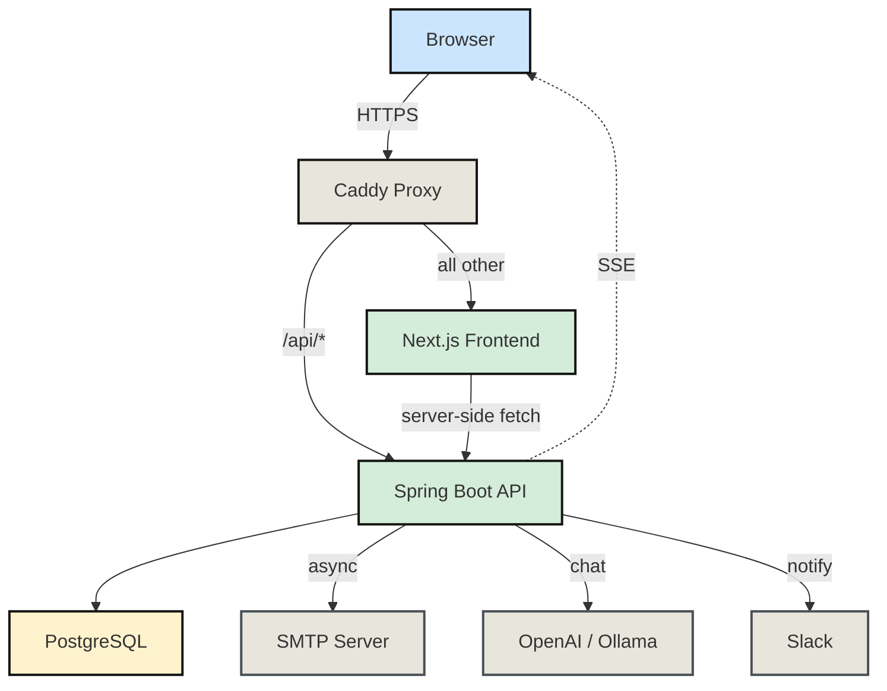
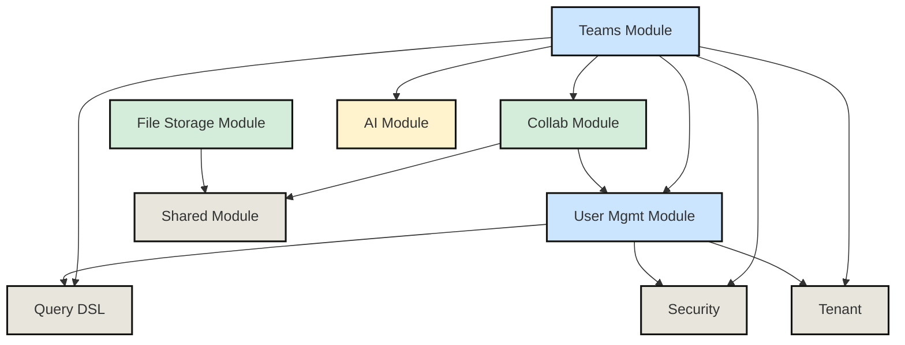
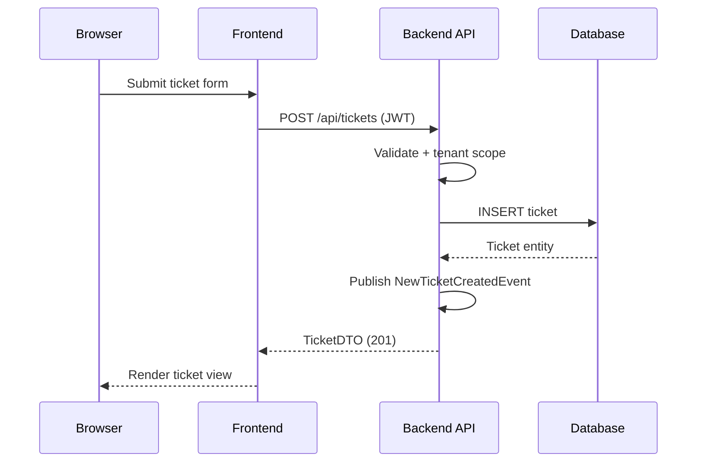
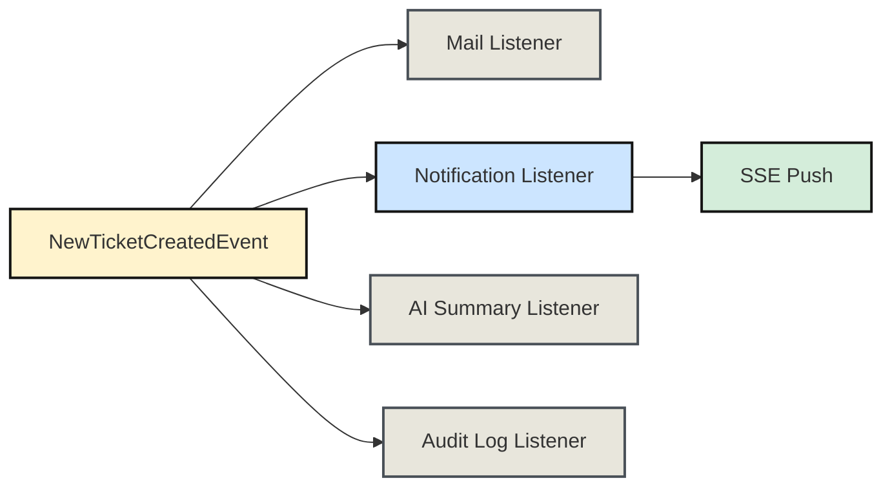
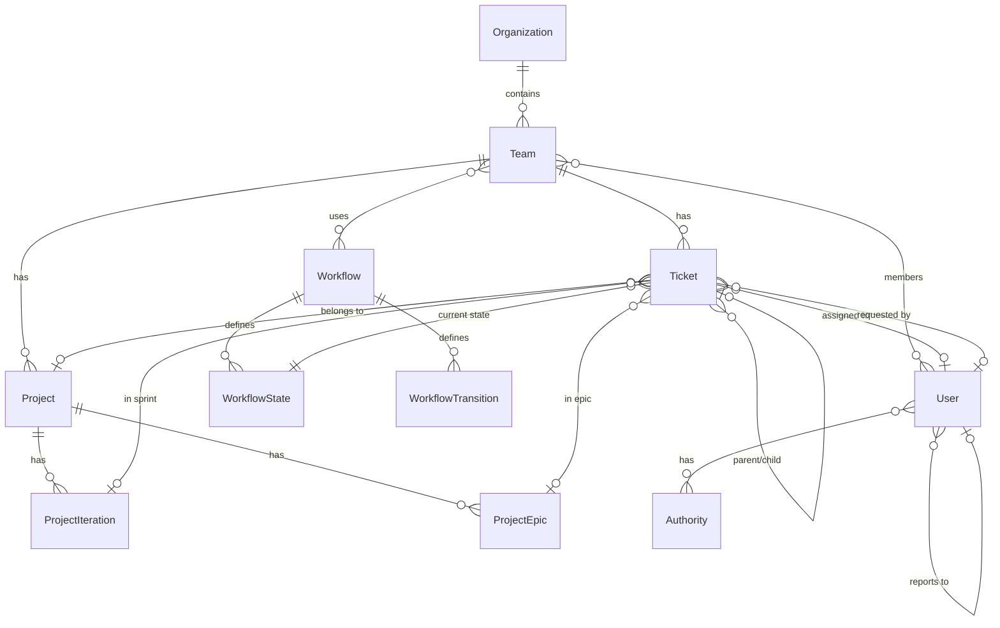
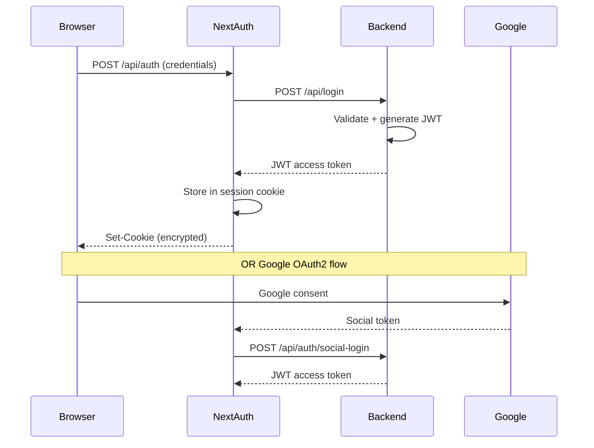
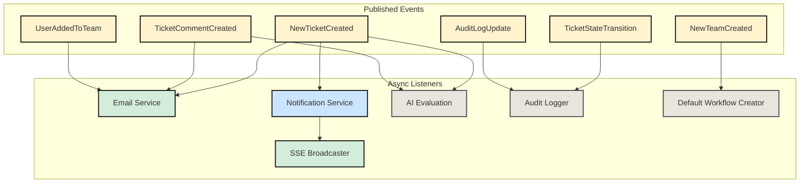
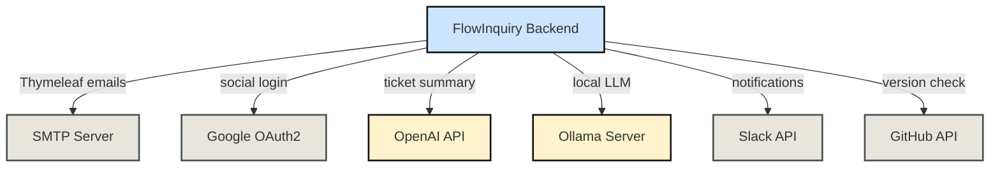
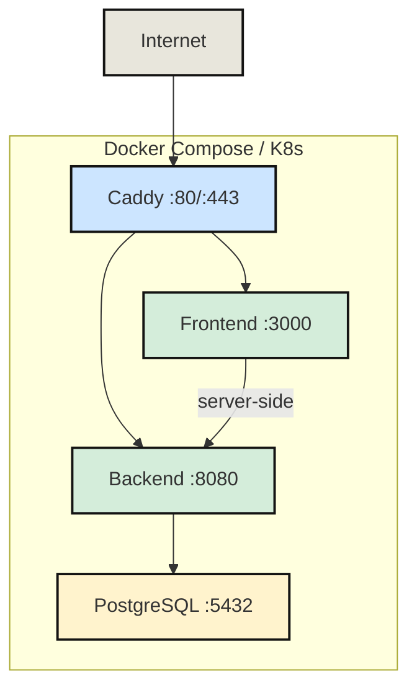
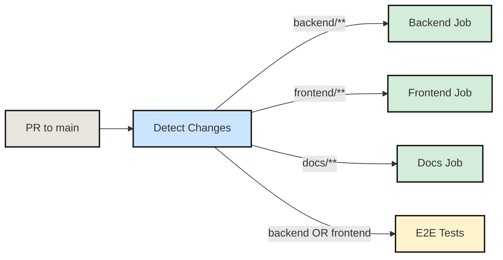

# FlowInquiry -- Architecture Documentation

> Open-source project, ticket, and request management with custom workflows, SLA tracking, and real-time collaboration.
>
> Version: 1.2.3 | License: AGPLv3
> Generated: March 2026
> Generated By: CHAI

## Executive Summary

FlowInquiry is a self-hosted, open-source work management platform built for teams that need customizable workflows, SLA enforcement, and real-time collaboration. The system follows a monorepo structure with a Spring Boot 3.5 backend (Java 21), a Next.js 16 frontend (React 19, TypeScript), and PostgreSQL as the sole data store. It supports multi-tenancy at the row level, event-driven internal processing, and deploys via Docker Compose or Kubernetes with Caddy as the reverse proxy. AI features (OpenAI/Ollama) provide ticket summarization and conversation health evaluation.

## System Overview

FlowInquiry is a three-tier web application fronted by a Caddy reverse proxy. The frontend is a server-rendered Next.js app that communicates with a Spring Boot API over REST. Real-time updates flow from the backend to the browser via Server-Sent Events (SSE).

### High-Level Architecture



Caddy routes `/api/*` (except `/api/auth/*`) to the Spring Boot backend on port 8080. Everything else -- pages, static assets, NextAuth endpoints -- goes to the Next.js frontend on port 3000.

## Technology Stack

| Category           | Technology                          | Purpose                                |
| ------------------ | ----------------------------------- | -------------------------------------- |
| Language           | Java 21                             | Backend business logic                 |
| Language           | TypeScript 5.9                      | Frontend type safety                   |
| Backend Framework  | Spring Boot 3.5                     | REST API, security, scheduling, events |
| Frontend Framework | Next.js 16 + React 19               | SSR, routing, API proxy                |
| UI Library         | ShadCN / Radix UI + Tailwind CSS 4  | Component system and styling           |
| Database           | PostgreSQL 16.3                     | Primary data store                     |
| ORM                | Hibernate 6 + Spring Data JPA       | Object-relational mapping              |
| Migration          | Liquibase 4.33                      | Version-controlled schema changes      |
| Auth               | JWT + NextAuth v5 + OAuth2 (Google) | Stateless authentication               |
| Cache              | Caffeine (L1) + Hibernate L2        | In-memory application and query cache  |
| Scheduling         | Spring @Scheduled + ShedLock        | Distributed cron jobs                  |
| AI                 | Spring AI (OpenAI + Ollama)         | Ticket summarization, health eval      |
| Real-time          | Server-Sent Events (SSE)            | Push notifications to browser          |
| Messaging          | Slack API client                    | Team notifications                     |
| Email              | Spring Mail + Thymeleaf             | Transactional emails                   |
| Build (Backend)    | Gradle + Jib                        | Compilation, containerization          |
| Build (Frontend)   | pnpm + Turborepo                    | Monorepo orchestration                 |
| CI/CD              | GitHub Actions                      | Test, build, deploy                    |
| Reverse Proxy      | Caddy                               | TLS termination, routing               |
| Container          | Docker Compose / Helm / Terraform   | Deployment                             |

## Repository Structure

```
flowinquiry/
+-- apps/
|   +-- backend/
|   |   +-- server/          # Spring Boot entry point (thin shell)
|   |   +-- commons/         # All business logic, entities, services
|   |   +-- tools/liquibase/ # Database migration changelogs
|   +-- frontend/            # Next.js 16 application
|   +-- docs/                # Nextra documentation site
|   +-- ops/                 # Deployment artifacts
|   |   +-- flowinquiry-docker/   # Docker Compose (HTTP + HTTPS)
|   |   +-- flowinquiry-k8s/     # Helm chart + Terraform
|   |   +-- terraform/            # Terraform wrapper
|   +-- cli/                 # CLI tooling
|   +-- mcp/                 # MCP integration
+-- buildSrc/                # Custom Gradle plugins (formatting, Jib)
+-- docker/                  # Local dev: Postgres compose + Jib entrypoint
+-- tools/                   # Build scripts, git hooks, env setup
+-- .github/workflows/       # CI/CD pipelines
+-- packages/                # Shared packages (monorepo workspace)
```

The monorepo uses Turborepo for frontend orchestration and Gradle multi-project for the backend. The `commons` module contains all domain logic while `server` is a thin boot shell.

## Architecture Pattern

FlowInquiry is a **modular monolith** with **event-driven internal processing**. The backend is a single deployable Spring Boot artifact, but the code is organized into domain modules (`teams`, `usermanagement`, `collab`, `fss`, `ai`, `shared`) with clear boundaries. Modules communicate via Spring `ApplicationEvent`s rather than direct service calls for cross-cutting concerns.

### Module Dependencies



The modular monolith approach gives domain isolation without the operational complexity of microservices. Event-driven communication between modules keeps coupling low and enables async processing for emails, notifications, and AI evaluations.

## Component Breakdown

### Backend: Teams Module

**Purpose**: Core domain -- teams, tickets, projects, workflows, organizations.
**Key path**: `commons/src/main/java/io/flowinquiry/modules/teams/`
**Dependencies**: User Management, Collaboration, AI, Query DSL

This is the largest module, containing:

- **Ticket lifecycle**: CRUD, state transitions via workflow engine, SLA tracking, overdue detection
- **Workflow engine**: States, transitions, cloning/referencing workflows across teams
- **Project management**: Projects with iterations (sprints), epics, Kanban board support, CSV/Excel export
- **Team management**: CRUD, membership, roles (guest/member/manager)
- **Organization hierarchy**: Nested organizational units

### Backend: User Management Module

**Purpose**: Authentication, authorization, user profiles, RBAC.
**Key path**: `commons/src/main/java/io/flowinquiry/modules/usermanagement/`
**Dependencies**: Security, Query DSL

Handles:

- **JWT authentication**: Login, token generation, refresh
- **OAuth2**: Google social login
- **Registration**: Email activation flow
- **RBAC**: Authorities (roles) -> Resources -> Permissions (READ/WRITE/ACCESS)
- **User hierarchy**: Manager/report chain, org chart

### Backend: Collaboration Module

**Purpose**: Cross-cutting collaboration features.
**Key path**: `commons/src/main/java/io/flowinquiry/modules/collab/`
**Dependencies**: User Management, Shared

Provides polymorphic features that attach to any entity:

- **Comments**: Threaded comments on tickets, projects, etc.
- **Notifications**: In-app notifications with SSE push
- **Activity logs**: Audit trail of field-level changes
- **Entity watchers**: Follow/unfollow entities for updates
- **Email**: Async email queue with retry logic, Thymeleaf templates
- **Slack integration**: Team channel notifications
- **App settings**: Key-value configuration store

### Backend: File Storage Module

**Purpose**: File upload, download, and entity attachments.
**Key path**: `commons/src/main/java/io/flowinquiry/modules/fss/`
**Dependencies**: Shared

Provides a `StorageService` interface with a local filesystem implementation. Entity attachments are polymorphic -- any entity type can have files attached.

### Backend: AI Module

**Purpose**: LLM-powered ticket analysis.
**Key path**: `commons/src/main/java/io/flowinquiry/modules/ai/`
**Dependencies**: Spring AI

Supports two providers via a common `ChatModelService` interface:

- **OpenAI**: Cloud-based (GPT models)
- **Ollama**: Self-hosted local LLM

Used for ticket content summarization and conversation health evaluation (triggered by events).

### Frontend: Next.js Application

**Purpose**: Server-rendered web UI with client-side interactivity.
**Key path**: `apps/frontend/src/`
**Dependencies**: Backend REST API, NextAuth

Organized as:

- `app/` -- Next.js App Router with route groups: `(auth)` for login/register, `portal/` for authenticated pages
- `components/` -- Domain components (teams, projects, tickets, workflows) + ShadCN UI primitives
- `lib/actions/` -- 14 API action modules wrapping backend REST calls
- `providers/` -- React Context providers for auth, permissions, team scope, errors
- `hooks/` -- Custom hooks for SSE, permissions, sidebar state, debounce
- `types/` -- TypeScript interfaces mirroring backend DTOs

## Data Flow

### Primary Request Flow: Ticket Creation



After the synchronous response, the event triggers multiple async listeners.

### Async Event Processing Flow



All event listeners run on the `asyncTaskExecutor` thread pool. The notification listener persists a notification record and pushes it to the user's SSE sink for real-time delivery. The mail listener queues an `EmailJob` which is picked up by the `SendRelayEmailJob` scheduler every 60 seconds (with retry up to 3 attempts).

### Scheduled Background Jobs

| Job                 | Schedule       | Purpose                                            |
| ------------------- | -------------- | -------------------------------------------------- |
| SLA Violation Check | Every 1 min    | Detects tickets exceeding SLA, sends notifications |
| SLA Warning         | Every 15 min   | Warns about upcoming SLA breaches                  |
| Overdue Email       | Daily midnight | Sends daily overdue ticket digest                  |
| Email Relay         | Every 60 sec   | Processes email queue with retry                   |
| Dedup Cache Cleanup | Daily midnight | Purges expired deduplication entries               |

All scheduled jobs use ShedLock for distributed locking, preventing duplicate execution across multiple backend instances.

## Data Model

### Core Entity Relationships



All core entities extend `TenantScopedAuditingEntity`, providing `tenant_id` for row-level multi-tenancy and `createdBy`, `createdDate`, `lastModifiedBy`, `lastModifiedDate` for audit tracking.

### Polymorphic Entity Pattern

Comments, activity logs, entity watchers, and attachments use an `EntityType` enum to associate with any domain entity. This avoids separate join tables per entity type while keeping a single, queryable structure.

## Authentication and Authorization

### Authentication Flow



The system uses a **dual-token strategy**: NextAuth manages the session cookie (encrypted, 30-day max age), while the backend issues a JWT (24-hour TTL, 30-day with remember-me). The frontend caches the access token in a module-level variable via `useAccessTokenManager()`.

### Authorization Model

The RBAC system maps: **Authority (Role) -> Resource -> Permission Level**

| Permission Level | Access         |
| ---------------- | -------------- |
| NONE             | No access      |
| READ             | View only      |
| WRITE            | Full CRUD      |
| ACCESS           | Administrative |

Frontend enforces permissions via `PermissionsProvider` (fetched on auth) + `usePagePermission()` hook. Backend enforces via Spring Security `@PreAuthorize` annotations.

## API Surface

The backend exposes a REST API under `/api/` with SpringDoc OpenAPI documentation. Major endpoint groups:

| Group           | Base Path                         | Operations                                  |
| --------------- | --------------------------------- | ------------------------------------------- |
| Authentication  | `/api/login`, `/api/authenticate` | Login, token validation                     |
| Account         | `/api/register`, `/api/account`   | Registration, activation, password reset    |
| Users           | `/api/users`                      | CRUD, search, hierarchy, org chart          |
| Teams           | `/api/teams`                      | CRUD, membership, roles                     |
| Tickets         | `/api/tickets`                    | CRUD, search, state transitions, statistics |
| Projects        | `/api/projects`                   | CRUD, export, iterations, epics             |
| Workflows       | `/api/workflows`                  | CRUD, clone, reference, state management    |
| Organizations   | `/api/organizations`              | CRUD, search                                |
| Authorities     | `/api/authorities`                | Role CRUD, permission management            |
| Notifications   | `/api/notifications`              | List, mark-read, unread count               |
| Comments        | `/api/comments`                   | CRUD on any entity                          |
| Files           | `/api/files`                      | Upload, download                            |
| Attachments     | `/api/entity-attachments`         | Attach files to entities                    |
| Activity Logs   | `/api/activity-logs`              | Audit trail queries                         |
| Entity Watchers | `/api/entity-watchers`            | Follow/unfollow entities                    |
| Settings        | `/api/settings`                   | App configuration                           |
| SSE             | `/sse/events/{userId}`            | Real-time event stream                      |
| AI Chat         | `/api/ai`                         | LLM conversation (conditional)              |
| Reports         | `/api/reports`                    | Ticket aging reports                        |
| Versions        | `/api/versions`                   | App version, update check                   |

The frontend uses a centralized `commons.action.ts` client that handles JWT injection, error handling, and request proxying. Advanced search uses a custom `QueryDTO` with nested `GroupFilter`s supporting AND/OR logic.

## Event Architecture

FlowInquiry uses Spring's `ApplicationEventPublisher` for internal event-driven processing. Events are published synchronously but consumed asynchronously via `@Async` listeners.

### Key Domain Events



This pattern decouples the core domain from side effects. A ticket creation only needs to persist the ticket -- email, notifications, AI summarization, and audit logging happen independently and do not block the response.

## External Integrations



| Integration   | Protocol    | Configuration                                                |
| ------------- | ----------- | ------------------------------------------------------------ |
| SMTP          | SMTP/TLS    | `spring.mail.*` properties, configurable via app settings UI |
| Google OAuth2 | OAuth2/OIDC | `GOOGLE_CLIENT_ID`, `GOOGLE_CLIENT_SECRET` env vars          |
| OpenAI        | HTTPS REST  | Spring AI auto-configuration, API key in properties          |
| Ollama        | HTTP REST   | Local server URL in Spring AI config                         |
| Slack         | HTTPS REST  | Slack API token in app settings                              |
| GitHub        | HTTPS REST  | Public raw content URL (version check only)                  |

All integrations are optional. The system functions without any of them -- email, AI, Slack, and Google login are all gracefully degraded when not configured.

## Configuration and Environment

### Key Environment Variables

| Variable                          | Purpose                     | Required             |
| --------------------------------- | --------------------------- | -------------------- |
| `POSTGRES_PASSWORD`               | Database password           | Yes                  |
| `JWT_BASE64_SECRET`               | JWT signing key (HMAC)      | Yes                  |
| `AUTH_SECRET`                     | NextAuth session encryption | Yes                  |
| `BACK_END_URL`                    | Backend URL (server-side)   | Yes                  |
| `NEXT_PUBLIC_BASE_URL`            | Public-facing URL           | Yes                  |
| `GOOGLE_CLIENT_ID`                | Google OAuth client         | No                   |
| `GOOGLE_CLIENT_SECRET`            | Google OAuth secret         | No                   |
| `SPRING_PROFILES_ACTIVE`          | Spring profile (dev/prod)   | No (defaults to dev) |
| `NEXT_PUBLIC_ENABLE_SOCIAL_LOGIN` | Enable social login UI      | No                   |

Secrets are generated by interactive setup scripts and never committed. The backend uses `dotenv-java` to read `.env.local` files in development.

### Deployment Topology



Three deployment options exist:

| Option                 | Tooling                         | External Access                     |
| ---------------------- | ------------------------------- | ----------------------------------- |
| Docker Compose (HTTP)  | `docker compose`                | Port 1234 -> Caddy :80              |
| Docker Compose (HTTPS) | `docker compose`                | Port 443 -> Caddy with internal TLS |
| Kubernetes             | Helm chart + optional Terraform | NodePort 31234 -> Caddy             |

A one-line install script downloads configs from GitHub, generates secrets interactively, and starts all services.

## Monorepo Structure

FlowInquiry uses a **hybrid monorepo** combining two build systems:

| Scope           | Tool                               | Config                                     |
| --------------- | ---------------------------------- | ------------------------------------------ |
| Frontend + Docs | pnpm workspaces + Turborepo        | `pnpm-workspace.yaml`, `turbo.json`        |
| Backend         | Gradle multi-project               | `settings.gradle`, `build.gradle`          |
| Cross-cutting   | npm scripts in root `package.json` | `backend:dev`, `frontend:dev`, `docker:up` |

The root `package.json` provides unified commands (`pnpm dev`, `pnpm build`, `pnpm test`) that delegate to the appropriate build system. Git hooks in `tools/githooks/` automatically format and lint changed files based on which directory was modified.

### CI/CD Pipeline



The CI pipeline uses path-based filtering (`dorny/paths-filter`) to run only the jobs affected by changes. Backend jobs include unit tests, integration tests (Testcontainers + PostgreSQL), and JaCoCo coverage. Coverage reports are posted as PR comments.

## Key Design Decisions

| Decision                   | Context                                      | Trade-offs                                                              |
| -------------------------- | -------------------------------------------- | ----------------------------------------------------------------------- |
| Modular monolith           | Small team, shared database                  | Simpler ops vs. less independent scaling per module                     |
| Row-level multi-tenancy    | Single database for all tenants              | Simpler infra vs. tenant isolation risk; mitigated by Hibernate filters |
| Undertow over Tomcat       | Lightweight embedded server                  | Lower memory footprint vs. smaller community ecosystem                  |
| Caffeine over Redis        | Single-instance deployments                  | No external dependency vs. cache lost on restart                        |
| SSE over WebSocket         | Unidirectional push (server to client)       | Simpler protocol, auto-reconnect vs. no client-to-server push           |
| Event-driven side effects  | Decouple domain from notifications/email/AI  | Better separation vs. eventual consistency and debugging complexity     |
| JWT + NextAuth dual tokens | Backend-issued JWT + NextAuth session cookie | Clean API auth vs. two token lifecycles to manage                       |
| Liquibase (programmatic)   | Tenant-aware schema migration at boot        | Per-tenant control vs. slower startup                                   |
| ShedLock                   | Distributed job locking without Redis        | DB-based locks vs. lock contention under heavy load                     |
| Jib for backend images     | Daemonless container builds                  | Fast, reproducible vs. less Dockerfile flexibility                      |
| Caddy as reverse proxy     | Automatic HTTPS, simple config               | Zero-config TLS vs. less flexibility than Nginx                         |
| Hybrid monorepo            | Java (Gradle) + JS (pnpm/Turbo) in one repo  | Atomic changes, shared CI vs. toolchain complexity                      |

---

_Generated by CHAI_
